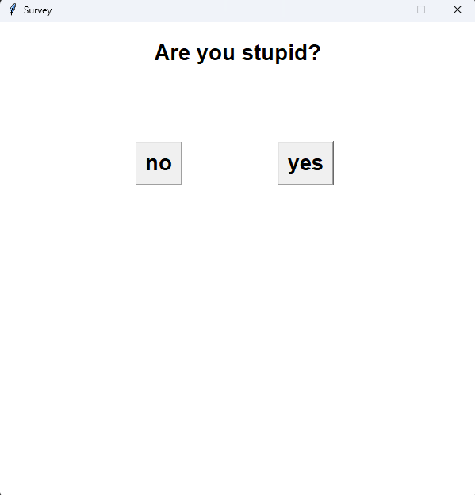

# 🏃 Survey Prank — Le bouton insaisissable 😈

Une mini-application de bureau en **Python** (avec **Tkinter**) : un sondage pose une question, mais le bouton **« no »** s'enfuit dès que vous essayez de l'atteindre. La seule réponse réellement cliquable… c'est **« yes »**.


---

## 📑 Sommaire

- [📖 Description](#-description)
- [✨ Fonctionnalités](#-fonctionnalités)
- [🎮 Comment ça marche](#-comment-ça-marche)
- [🔧 Technologies utilisées](#-technologies-utilisées)
- [🚀 Installation](#-installation)
- [🧩 Personnalisation](#-personnalisation)
- [📂 Structure du projet](#-structure-du-projet)
- [📸 Aperçu](#-aperçu)
- [🤝 Contribution](#-contribution)
- [📜 Licence](#-licence)
- [👤 Auteur](#-auteur)

---

## 📖 Description

**Survey Prank** est un petit projet ludique qui détourne le comportement habituel d'une interface graphique : au lieu de réagir au clic, le bouton « no » **esquive l'utilisateur**. Chaque tentative est comptabilisée et accompagnée d'une petite pique humoristique.

Le projet tient en un seul fichier, ne nécessite **aucune dépendance externe** et constitue un bon exemple pour apprendre :

- la gestion des événements Tkinter (`<Enter>`, `<FocusIn>`, `<Button-1>`) ;
- le placement dynamique de widgets avec `place()` ;
- la détection de collisions entre rectangles ;
- l'organisation d'une application Tkinter sous forme de classe.

---

## ✨ Fonctionnalités

- 🏃 **Bouton « no » insaisissable** : il se déplace aléatoirement à chaque tentative
- 🖱️ **Triple esquive** : survol de la souris, clic **et** focus clavier (impossible de tricher avec `Tab` + `Espace`)
- 📏 **Distance de sécurité** : le bouton ne réapparaît jamais à moins de 120 px du curseur
- 🚫 **Aucun chevauchement** : il n'atterrit jamais sur le bouton « yes »
- 💬 **Répliques moqueuses** aléatoires (*« Too slow! »*, *« Nice try. »*, …)
- 🔢 **Compteur d'échappées** affiché en direct
- 🔒 **Fermer la fenêtre n'est pas une issue** : la croix affiche un message au lieu de quitter
- 🎉 **Message final** indiquant combien de fois le bouton vous a échappé
- 📦 **Zéro dépendance** : uniquement la bibliothèque standard de Python

---

## 🎮 Comment ça marche

Le bouton « no » est relié à la fonction `dodge()` par trois événements :

| Événement | Déclencheur | Pourquoi |
|---|---|---|
| `<Enter>` | Le curseur survole le bouton | Cas classique |
| `<Button-1>` | Clic gauche | Si le curseur est trop rapide |
| `<FocusIn>` | Le bouton reçoit le focus clavier | Empêche `Tab` + `Espace` |

À chaque esquive, l'algorithme :

1. tire jusqu'à **100 positions aléatoires** dans la fenêtre ;
2. garde la première qui est **assez loin du curseur** (`SAFE_DISTANCE`) ;
3. et qui **ne chevauche pas** le bouton « yes » (fonction `overlaps()`) ;
4. déplace le bouton, incrémente le compteur et affiche une réplique.

> 💡 Pour quitter l'application, il n'y a qu'une solution : répondre **« yes »** (ou interrompre le programme depuis le terminal avec `Ctrl + C`).

---

## 🔧 Technologies utilisées

- [Python 3](https://www.python.org/)
- `tkinter` (`Tk`, `Label`, `Button`, `messagebox`) — interface graphique
- `random` — positions et répliques aléatoires

---

## 🚀 Installation

1. **Cloner le dépôt**
   ```bash
   git clone https://github.com/mohammedguerrout/survey-prank.git
   cd survey-prank
   ```

2. **Vérifier que Tkinter est disponible**

   Tkinter est inclus dans les installateurs officiels de Python (Windows et macOS).
   Sur Debian / Ubuntu, il faut parfois l'installer séparément :
   ```bash
   sudo apt install python3-tk
   ```

3. **Lancer l'application**
   ```bash
   python main.py
   ```

> ℹ️ Aucun `pip install` n'est nécessaire : le projet n'utilise que la bibliothèque standard.

---

## 🧩 Personnalisation

Les paramètres principaux se trouvent en haut de `main.py` :

```python
WIDTH, HEIGHT = 600, 600     # Taille de la fenêtre
SAFE_DISTANCE = 120          # Distance minimale entre le curseur et le bouton « no »
TAUNTS = [                   # Répliques affichées à chaque esquive
    "Too slow!",
    "Nice try.",
    "Missed me!",
    # Ajoutez les vôtres ici !
]
```

Vous pouvez aussi modifier la question, les textes des boutons et le message final directement dans la classe `Survey`.

---

## 📂 Structure du projet

```
survey-prank/
│
├── main.py              # Fichier principal de l'application
├── screenshots/         # Captures d'écran / GIF de démonstration
├── README.md            # Documentation du projet
├── LICENSE              # Licence MIT
└── .gitignore           # Fichiers ignorés par Git
```

---

## 📸 Aperçu

<div align="center">



*Le bouton « no » en pleine fuite* 🏃💨

</div>

---

## 🤝 Contribution

Les contributions sont les bienvenues ! Quelques idées : nouveaux messages, thème sombre, niveaux de difficulté, bouton qui accélère à chaque esquive…

1. Faites un *fork* du projet
2. Créez une branche (`git checkout -b feature/ma-fonctionnalite`)
3. Commitez vos changements (`git commit -m 'Ajout de ma fonctionnalité'`)
4. Poussez vers la branche (`git push origin feature/ma-fonctionnalite`)
5. Ouvrez une *Pull Request*

---

## 📜 Licence

Ce projet est distribué sous licence **MIT**. Voir le fichier [LICENSE](LICENSE) pour plus de détails.

---

## 👤 Auteur

**Mohammed Guerrout**

- GitHub : [@mohammedguerrout](https://github.com/mohammedguerrout)

<div align="center">

⭐ **Si ce projet vous a fait sourire, n'hésitez pas à lui laisser une étoile !** ⭐

</div>
